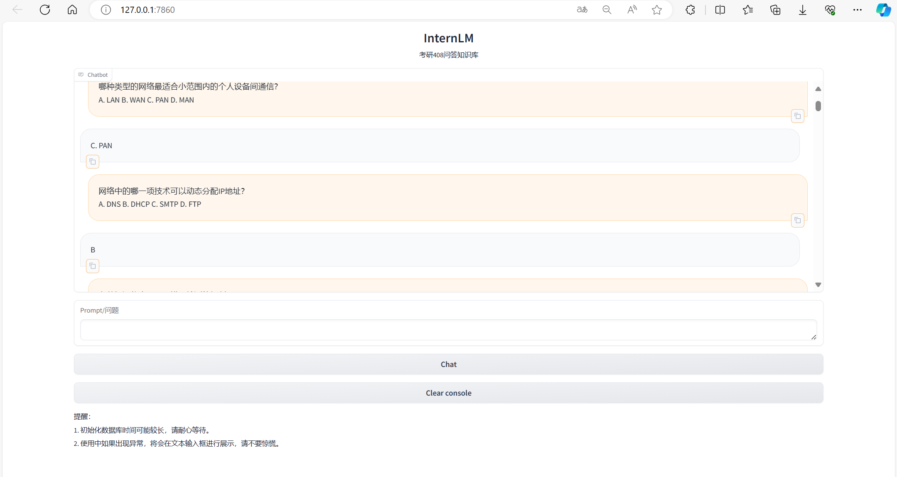
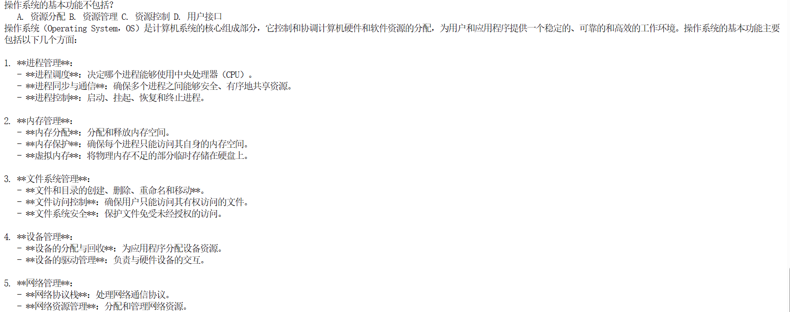
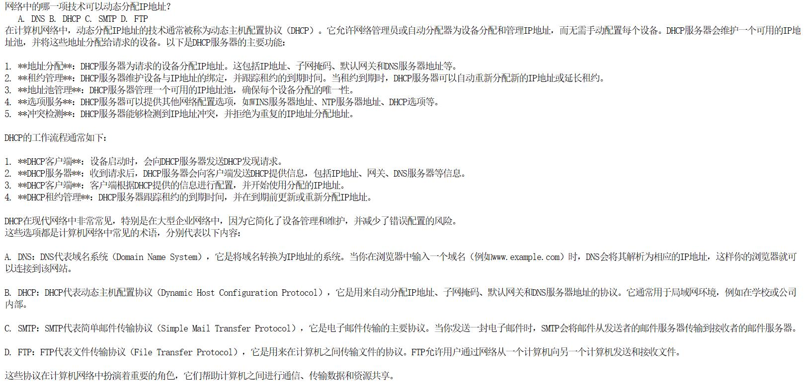
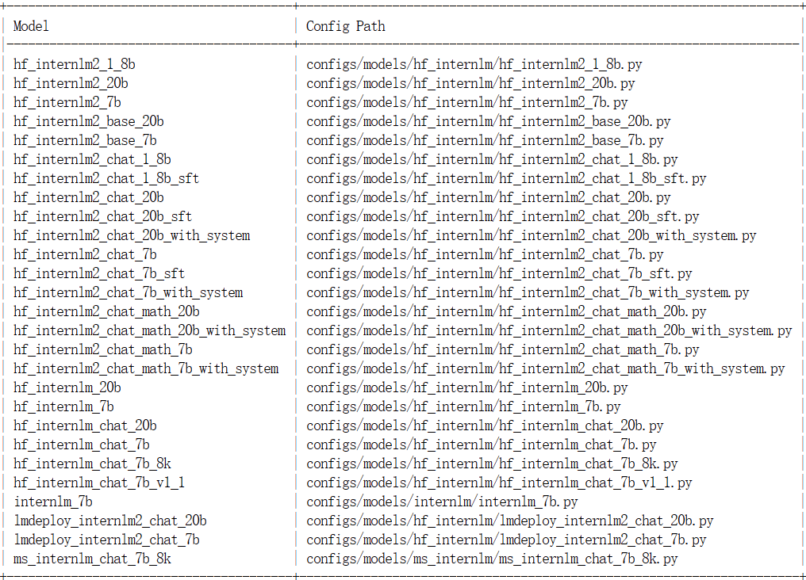
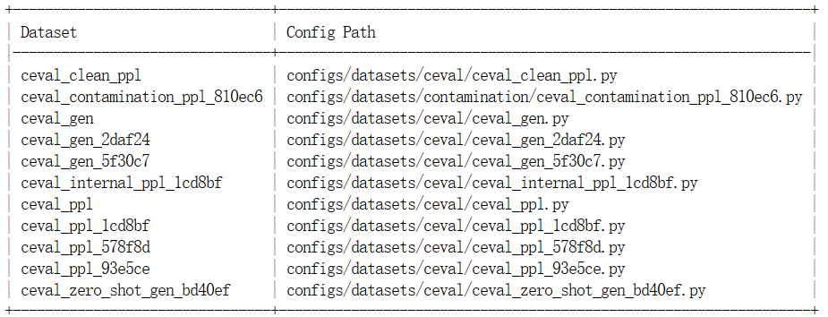

# assistant408

  <div align="center">
    </br>
    <b><font size="5">assistant408</font></b></br></br>
    <b><font size="5">基于Internlm2-chat-7b模型的408考研小助手</font></b>
  </div>


## 🖊️ 目录
- [📖 简介](#-简介)
- [🚀 快速开始](#-快速开始)
  * [知识库](#-知识库)
  * [微调](#-微调)
    + [准备数据集](#-准备数据集)
    + [准备配置文件](#-准备配置文件)
    + [修改配置文件](#-修改配置文件)
    + [开始训练](#-开始训练)
    + [转换格式](#-转换格式)
    + [模型合并](#-模型合并)
    + [模型运行](#-模型运行)
  * [模型量化](#-模型量化)
  * [模型评测](#-模型评测)
- [🙂 项目成员](#-项目成员)
- [💕 致谢](#-致谢)


## 📖 简介
&emsp;&emsp;assistant408（考研408计算机学科专业基础综合的小助手）是一个集成 408 考研知识及解答能力的大语言模型。
> 408全称计算机专业基础综合，共包括四门专业课的考察，分别是数据结构、计算机组成原理、操作系统和计算机网络。
> |  考试科目  |   数据结构   |   计算机组成原理   | 操作系统 | 计算机网络 |
>|:------:|:------:|:-------:|:-------:|:-------:|
> |分数|45分|45分|35分|25分|
> |考试占比|30%|30%|23%|17%|

&emsp;&emsp;该模型基于Internlm2-chat-7b基座模型，使用模型容易出错的概念性题目进行微调，再使用GPT生成的400道题目进行评测，得到了较好的效果。

## 🚀 快速开始
### 📝 知识库
&emsp;&emsp;在本次知识库搭建中用到了如下知识，有需要的可以自行前往下载，在本仓库 data_base/vector_db/chroma 目录下已经为大家搭建好了训练后的知识库，可以将本仓库 clone 到本地。
- [x] 25王道考研数据结构
- [x] 25王道考研计算机组成原理
- [x] 25王道考研操作系统
- [x] 25王道考研计算机网络
- [x] ...
```bash
git clone https://github.com/zgiggle/assistant408.git
```

&emsp;&emsp;如果需要自定义知识库，可以参考create_db.py，首先将本地知识库通过Unstructed Loader转化为纯文本格式，纯文本再经过Text Splitter分为Chunks，通过Sentence Transformer转化为向量格式并存放在Chroma向量数据库中。对于用户的输入同样通过Sentence Transformer转为向量格式，再与向量数据库进行相似度匹配，找到与用户输入相关的文本段，最后将文本段嵌入到写好的Prompt Template中并交给InternLM回答。这整个过程都会被封装在检索问答流中，我们可以将个性化配置引入检索问答流中，就能搭建属于自己的RAG应用。  

&emsp;&emsp;目录下的LLM.py文件用于自定义LLM类，在终端使用如下命令即可运行食用（注意修改run_internlm.py中的模型地址）。
```bash
python run_internlm.py
```

### 📝 微调
__1. 准备数据集__
&emsp;&emsp;在本仓库的 data/xtuner_data 目录下已经准备好了训练的数据集，微调数据集结构如下。
```text
input: 计算机中，浮点数的指数部分通常采用什么方式进行编码？
output: 移码。
input: 哪种类型的存储器通常被用作计算机的主存储器？
output: SRAM。
input: 在计算机系统中，一个32位的指令长度意味着什么？
output: 指令的长度是32位。
input: 什么是衡量CPU性能的一个重要指标？
output: 时钟频率、核心数、缓存大小。
input: 请做一下自我介绍。
output: 你好,我是考研408计算机学科专业基础综合的小助手哦。
```

__2. 准备配置文件__
```bash
mkdir /root/personal_assistant/config/question && cd /root/personal_assistant/config/question
xtuner copy-cfg internlm2_chat_7b_qlora_oasst1_e3 .
```

__3. 修改配置文件__
```python
# 修改模型为本地路径
pretrained_model_name_or_path = '/root/share/module_repos/internlm2-chat-7b'

# 修改训练数据集为本地路径
data_path = '/root/personal_assistant/data/xtuner_data/answer2.json'

# 修改配置文件PART 1参数
max_length = 2048
max_epochs = 12
evaluation_freq = 90
SYSTEM = '您是考研408计算机学科专业基础综合小助手，您始终根据提问者的问题提供准确、全面和详细的答案。'
evaluation_inputs = [
    '请做一下自我介绍',
    '计算机中，浮点数的指数部分通常采用什么方式进行编码', 
    '在计算机系统中，中断的作用是什么？',
    '在操作系统中，死锁发生的必要条件之一是：',
    '哪种设备不适合使用缓冲区（Buffer）技术？',
    '在计算机系统中，什么决定了计算机执行指令的速度？'
]

# 修改配置文件PART 3参数
dataset=dict(type=load_dataset, path='json', data_files=dict(train=data_path))
dataset_map_fn=None

```

__4. 开始训练__
```bash
cd /root/personal_assistant/config/question
xtuner train internlm2_chat_7b_qlora_oasst1_e3_copy.py
```
__5. pth格式转换为hugging face格式__
```bash
mkdir /root/personal_assistant/config/question/work_dirs/hf
export MKL_SERVICE_FORCE_INTEL=1

# 配置文件存放的位置
export CONFIG_NAME_OR_PATH=/root/personal_assistant/config/question/internlm2_chat_7b_qlora_oasst1_e3_copy.py

# 模型训练后得到的pth格式参数存放的位置
export PTH=/root/personal_assistant/config/question/work_dirs/internlm2_chat_7b_qlora_oasst1_e3_copy/iter_384.pth

# pth文件转换为Hugging Face格式后参数存放的位置
export SAVE_PATH=/root/personal_assistant/config/question/work_dirs/hf

# 执行参数转换
xtuner convert pth_to_hf $CONFIG_NAME_OR_PATH $PTH $SAVE_PATH
```
__6. 模型合并__
```bash
export MKL_SERVICE_FORCE_INTEL=1
export MKL_THREADING_LAYER='GNU'

# 原始模型参数存放的位置
export NAME_OR_PATH_TO_LLM=/root/share/model_repos/internlm2-chat-7b

# Hugging Face格式参数存放的位置
export NAME_OR_PATH_TO_ADAPTER=/root/personal_assistant/config/question/work_dirs/hf

# 最终Merge后的参数存放的位置
mkdir /root/personal_assistant/config/question/work_dirs/hf_merge
export SAVE_PATH=/root/personal_assistant/config/question/work_dirs/hf_merge

# 执行参数Merge
xtuner convert merge \
    $NAME_OR_PATH_TO_LLM \
    $NAME_OR_PATH_TO_ADAPTER \
    $SAVE_PATH \
--max-shard-size 2GB
```
__7. 模型运行__  
&emsp;&emsp;提供两种运行方式，第一种方式为运行web_demo.py，首先修改模型路径为合并后的微调模型，再进行运行。
```python
model = (AutoModelForCausalLM.from_pretrained('/root/personal_assistant/config/question/work_dirs/hf_merge',
                                                  trust_remote_code=True).to(
                                                      torch.bfloat16).cuda())
tokenizer = AutoTokenizer.from_pretrained('/root/personal_assistant/config/question/work_dirs/hf_merge',
                                              trust_remote_code=True)
```
```bash
# 开始运行
cd /root/personal_assistant/code/InternLM/chat
streamlit run web_demo.py --server.address 127.0.0.1 --server.port 7860
```
&emsp;&emsp;运行效果如下：  


&emsp;&emsp;第二种方式为运行run_internlm.py，首先修改模型路径为合并后的微调模型，再进行运行。
```python
llm = InternLM_LLM(model_path = "/root/personal_assistant/config/question/work_dirs/hf_merge")
```
```bash
# 开始运行
python run_internlm.py
```
&emsp;&emsp;运行效果如下：  


### 📝 模型量化  
&emsp;&emsp;使用如下命令进行量化并运行：
```bash
# 开始W4A16量化
export HF_MODEL=/root/personal_assistant/config/question/work_dirs/hf_merge
export WORK_DIR=/root/personal_assistant/model/internlm2_chat_7b_4bit

lmdeploy lite auto_awq \
   $HF_MODEL \
  --calib-dataset 'ptb' \
  --calib-samples 128 \
  --calib-seqlen 2048 \
  --w-bits 4 \
  --w-group-size 128 \
  --work-dir $WORK_DIR
```
&emsp;&emsp;使用lmdeploy chat即可快速体验量化后的结果，可以明显将 19G 显存占用降低


### 📝 模型评测
&emsp;&emsp;首先，我们团队对微调前模型和微调后+向量数据库模型分别进行 400 道 408 考题的测试，其中每门科目 100 道，其中测试题由GPT给出，测试题可以在 data/test_data 获取。
|  正确率  |   数据结构   |   计算机组成原理   | 操作系统 | 计算机网络 |
|:------:|:------:|:-------:|:-------:|:-------:|
|训练前模型|--|--|--|--|
|训练后模型|85%|86%|79%|90%|

&emsp;&emsp;经过测试发现，训练后的模型能够快速响应，并给出答案，正确率较高，而训练前模型响应速度慢，准确率低，响应内容多而杂，不是想要的结果。  
&emsp;&emsp;训练前模型响应效果：  
  


&emsp;&emsp;训练后模型响应效果：  


&emsp;&emsp;最后，我们进行了opencompass评测，首先环境准备：
```bash
# 环境准备
git clone https://github.com/open-compass/opencompass
cd opencompass
pip install -e .

# 数据准备
cp /share/temp/datasets/OpenCompassData-core-20231110.zip /root/opencompass/
unzip OpenCompassData-core-20231110.zip
```
&emsp;&emsp;进入环境准备的目录，执行如下命令，查看支持的模型和数据集。
```bash
python tools/list_configs.py internlm ceval
```
&emsp;&emsp;支持的模型如下，选择适配的internlm2-chat-7b模型：  

&emsp;&emsp;支持的数据集如下：  

&emsp;&emsp;评测的结果位于opencompass/after_train.csv


## ‍‍‍‍‍🙂 项目成员
- 张丰瑞，主要负责模型微调、量化、评测。
- 杨阳，主要负责 408 题目收集和评测。
- 周殷稷，主要负责知识库收集，向量数据库搭建。
- 曹一凡，主要负责收集微调数据并微调。

## 💕 致谢
<div align="center">

**感谢上海人工智能实验室组织的 书生·浦语实战营 学习活动 与 算力支持~**

</div>


